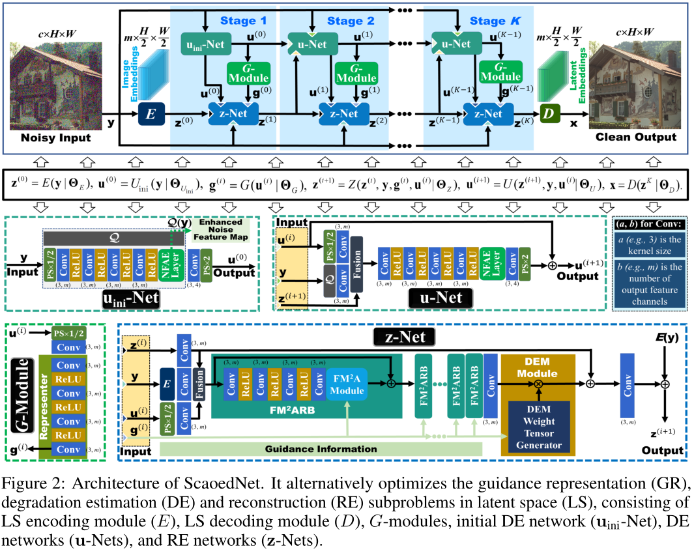
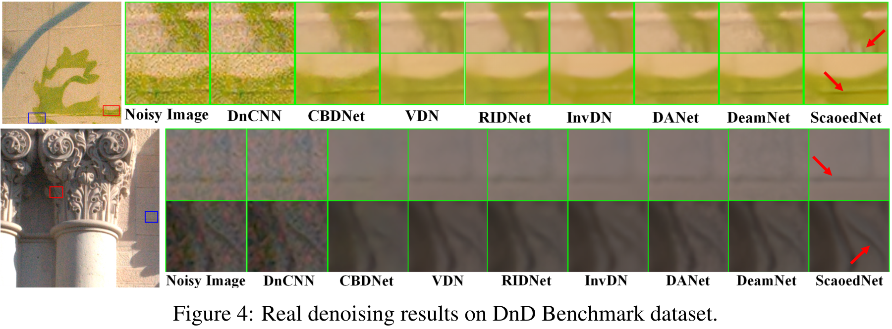
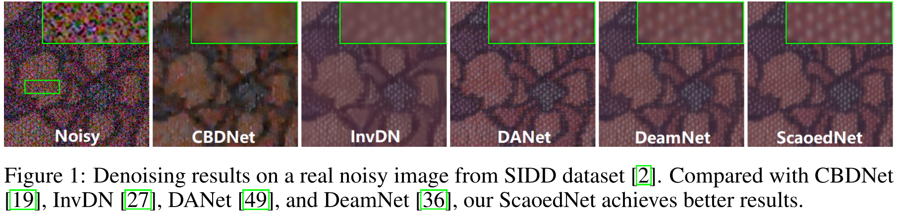

# Enhanced Latent Space Blind Model for Real Image Denoising via Alternative Optimization (NeurIPS 2022)

Our experiments are done with:

- Python 3.7.9
- PyTorch 1.7.1
- numpy 1.19.5
- opencv 4.5.1
- scikit-image 0.17.2


### Network Structure


### Result




### Test on SIDD Validation
You can get the complete dataset from https://www.eecs.yorku.ca/~kamel/sidd/benchmark.php.

run `test_sidd`


### Citation

```
@inproceedings{
ren2022enhanced,
title={Enhanced Latent Space Blind Model for Real Image Denoising via Alternative Optimization},
author={Chao Ren and Yizhong Pan and Jie Huang},
booktitle={Advances in Neural Information Processing Systems},
editor={Alice H. Oh and Alekh Agarwal and Danielle Belgrave and Kyunghyun Cho},
year={2022},
url={https://openreview.net/forum?id=Qt4rKNYzcO}
}
```
